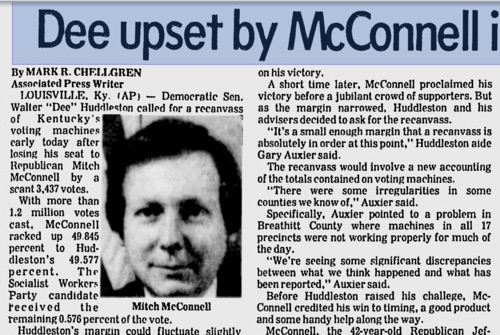
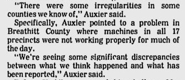

# Mitch McConnell's 2020 Reelection Campaign
> As of December 26, 2021, this story is but an idea.
> Do you think it's interesting how someone hated as much 
> as Mitch McConnell is hated keeps getting reelected in Kentucky? 
> 
> Do you think that it's possible that Mitch McConnell isn't a very 
> honest person, committed to the idea that all people are created 
> equal, and that democracy is a good thing?
> 
> If so, you should help out and do some research or writing for this story. 
> Join the crowded newsroom by editing [this research file on github.com](https://github.com/scotuslog/crowdednews/edit/main/mitch-election-2020/RESEARCH.md).
> 
> You don't have to add anything to the RESEARCH.md document. You can just [edit this file right now on github.com](> [Edit this file on github.com](https://github.com/scotuslog/crowdednews/edit/main/mitch-election-2020/README.md), become contributor).
> 
> View [RESEARCH.md](RESEARCH.md).

Every county in Kentucky. With his latest 2020 victory, Senator Mitch McConnell has now won every single county in Kentucky in at least one of his senate victories since 1984, according to [Center for Politics](https://centerforpolitics.org/crystalball/articles/coalition-shifts-in-senate-races-sc-ky-il/). I was 12 years old when McConnell took that senate seat from the Democrats.

Amy McGrath ran against McConnell in 2020. She didn't do well, only pulling in 38.2 percent of the vote. The only candidate to do worse against McConnell in his 6 reelection bids was Lois Combs Weinberg. Weinberg got only 35.3 percent in 2002.

## Mitch's Money
According to [BallotPedia](https://ballotpedia.org/Mitch_McConnell), McConnell's salary is $193,400 a year, yet his net worth is just over $22.8 million.

## Senate Races

# The 1984 Senate Race Victory
The 1984 election that started McConnell's senate career was tight. McConnell road that Ronald Reagan rocket ship to the US Senate by barely beating Democratic Incumbent Walter Dee Huddleston. The margin of victory was 3,437 votes out of more than 1.2 million votes cast, according to [the Associated Press at the time](https://news.google.com/newspapers?id=XLRDAAAAIBAJ&pg=1340,2543281).

[Google News Archive](https://news.google.com/newspapers?id=XLRDAAAAIBAJ&pg=1340,2543281)

The Huddleston campaign voiced concerns about dirty politics in 1984.

### 1990
> We need more info here about the 2014 race
> Edit this file on github.com and contribute.
> [Edit this file on github.com](https://github.com/scotuslog/crowdednews/edit/main/mitch-election-2020/README.md) and contribute.

### 1996
> We need more info here about the 2014 race
> Edit this file on github.com and contribute.
> [Edit this file on github.com](https://github.com/scotuslog/crowdednews/edit/main/mitch-election-2020/README.md) and contribute.

### 2002
> We need more info here about the 2014 race
> [Edit this file on github.com](https://github.com/scotuslog/crowdednews/edit/main/mitch-election-2020/README.md) and contribute.

### 2008
> We need more info here about the 2014 race
> [Edit this file on github.com](https://github.com/scotuslog/crowdednews/edit/main/mitch-election-2020/README.md) and contribute.

### 2014
> We need more info here about the 2014 race
> Edit this file on github.com and contribute.
McConnell stomped all over his Democratic challenger in 2014. Alison Lundergan Grimes did better than McGrath would do in 2020, but not by much. Lungergran Grimes got just 40.7 percent of the vote. McConnell got 56.2 percent.

The total vote count in 2014 for this Kentucky senate seat was 1.4 million

### 2020
> We need more details about this election. 
> There have been reports of McConnell winning districts by margins 
> far greater than expected.
McConnell had no problem destroying Amy McGrath. McConnell got approximately 400,000 more votes than McGrath from a total vote count of 2.1 million.

Looking back at 2020, would Charles Booker have been a stronger candidate than McGrath. Democratic voters chose McGrath. She got 45.4 percent of the primary vote. Booker got 42.6 percent.

What's interesting about the total vote count is how 700,000 more people voted in 2020 than did so 2014.